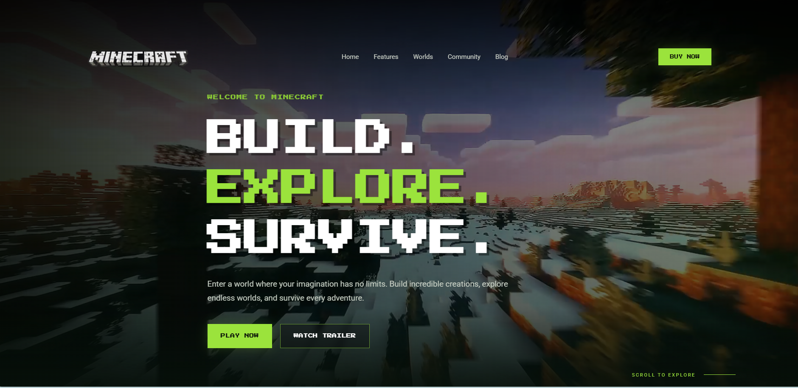
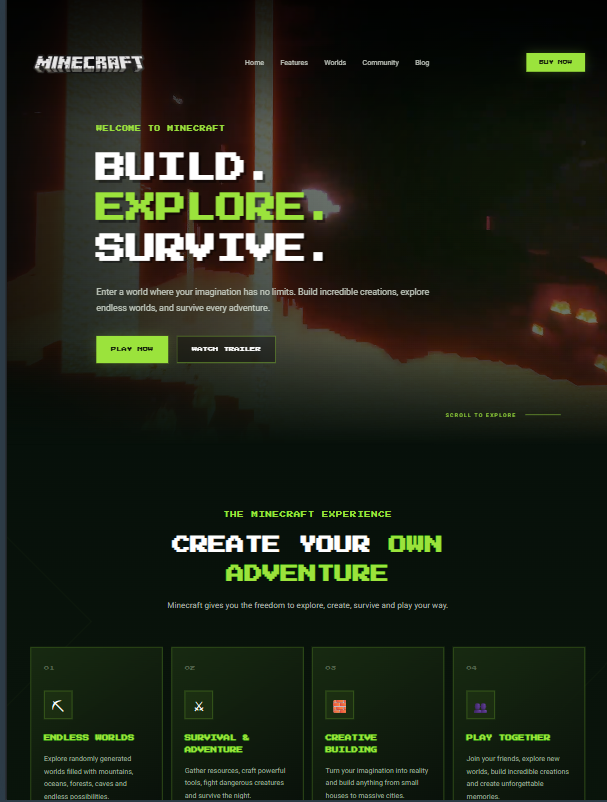
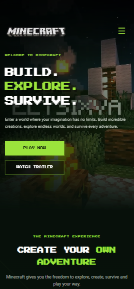
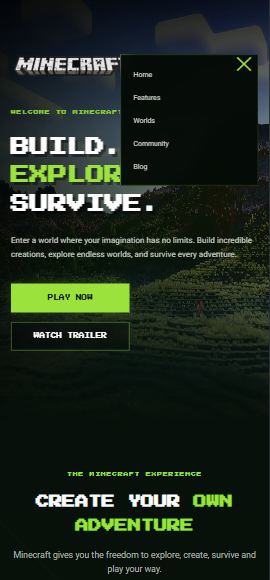

# Minecraft Landing Page

A responsive gaming landing page inspired by Minecraft, designed to showcase the game's world, features, game modes, community, and latest updates.

## Features

- Responsive design for desktop, tablet, and mobile
- Hero section with background video
- Interactive navigation and mobile menu
- Game features section
- Game modes and worlds section
- Community section
- Blog section with image sliders
- Animated sections and hover effects
- Interactive trailer modal
- Clear call-to-action buttons
- Responsive footer

## Technologies Used

- HTML5
- CSS3
- JavaScript
- Google Fonts

## Project Structure

Minecraft/
├── images/
├── video/
├── minecraft.html
├── minecraft.css
├── minecraft.js
└── README.md

## Responsive Design

The landing page is optimized for:

- Desktop
- Tablet
- Mobile

## Interactive Elements

The website includes:

- Hover effects
- Scroll animations
- Mobile navigation menu
- Image sliders
- Trailer video modal
- Animated CTA sections

## Live Demo

[View Live Demo](https://hanaahmed2005.github.io/minecraft-landing-page/)

## Screenshots

### Desktop

### Tablet

### Mobile

### Mobile Menu

## Author

Hana Ahmed
